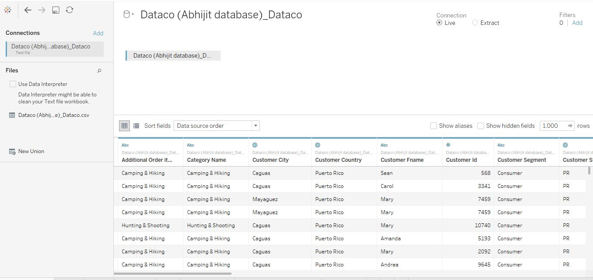
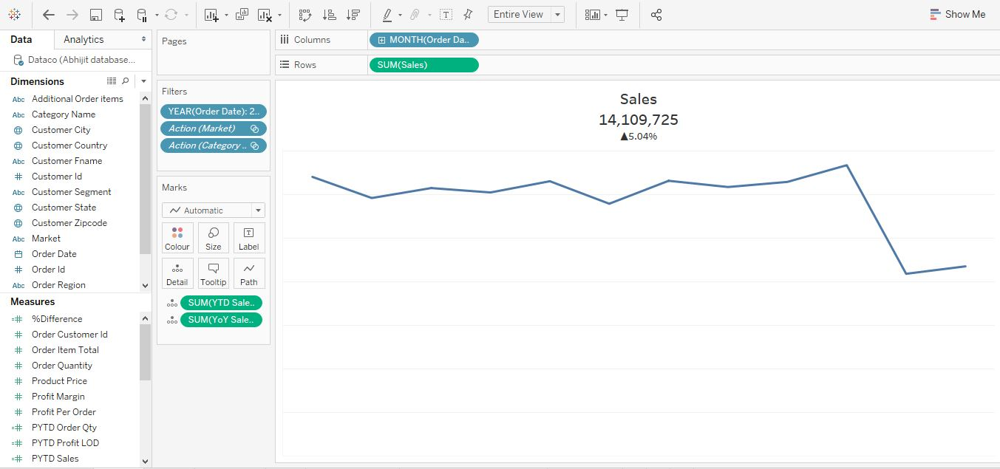
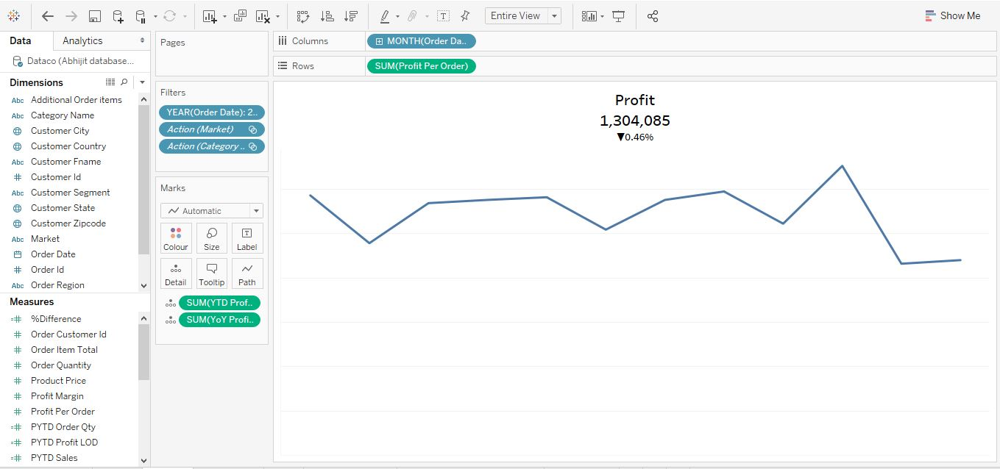
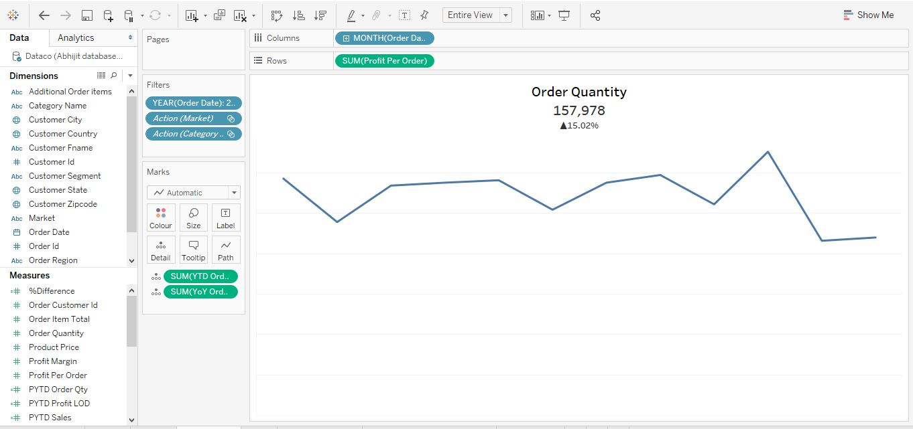
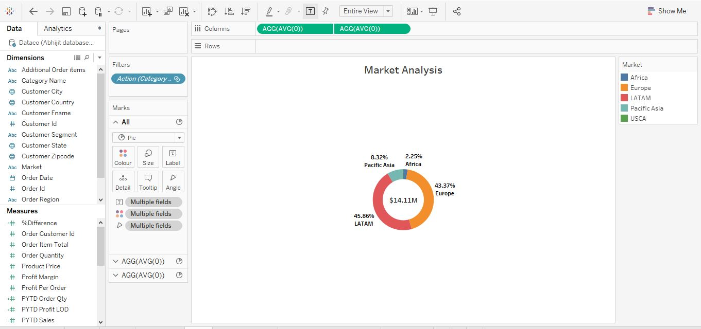
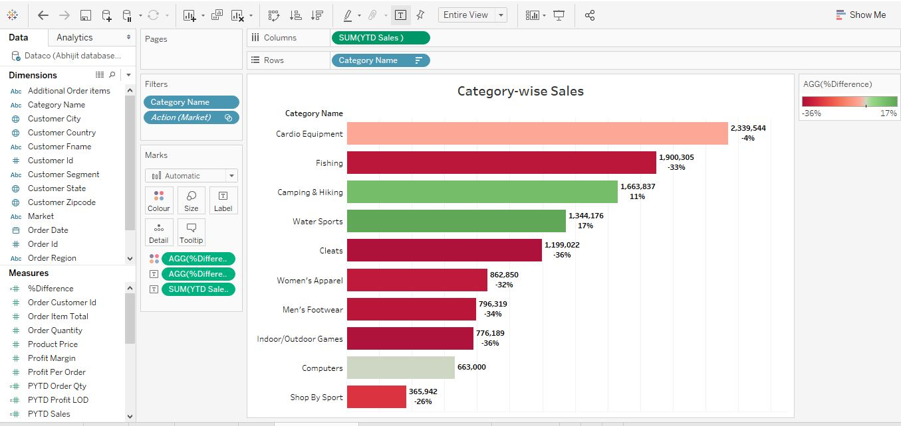
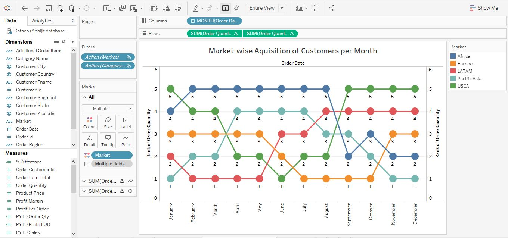
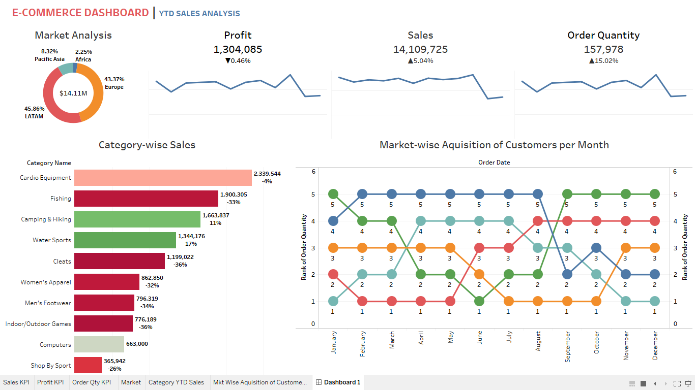

# YTD Sales Analysis

## Introduction
Welcome to the E-Commerce project, where I dive deep into the key performance indicators (KPIs) that drive the success of an online business. In this comprehensive analysis, I will explore the profit, sales, order quantity, category, and market trends that have shaped the performance thus far. By examining these KPIs, I aim to gain valuable insights that will inform strategic decisions and drive future growth.

The dataset(CSV file) for this analysis is attached and the workspace used is **_Tableau_**

## Skills/ concepts demonstrated:
- Created calculated fields for "YTD Sales LOD, PYTD Sales LOD, YoY Sales"
- Created calculated fields for "YTD Profit LOD, PYTD Profit LOD, YoY Profit"
- Created calculated fields for "YTD Order Qty LOD, PYTD Order Qty LOD, YoY Order Qty"

## Different KPIs:
### 1) Sales  

### 2) Profit

### 3) Order Quantity

### 4) Market Analysis

### 5) Top 10 Selling Category

### 6) Customers Acquired For Each Month

### E-Commerce Dashboard
_Compared to the previous year sales, we are able to see the areas that had a drop and the areas that had an increase._

  

## Observation and Recommendation:
1. *Focus on High-Performing Regions*:
   - *Observation*: Latin America (LATAM) and Europe contribute the most to sales, making up 45.86% and 43.37% respectively.
   - *Recommendation*: Increase investment in marketing and operations in LATAM and Europe to capitalize on their strong performance. Explore expansion strategies in these regions to drive further growth.

2. *Address Declining Categories*:
   - *Observation*: Categories like Fishing (-33%), Cleats (-36%), Women's Apparel (-32%), Men's Footwear (-34%), Indoor/Outdoor Games (-36%), and Shop by Sport (-26%) are experiencing significant sales declines.
   - *Recommendation*: Analyze the reasons for the decline in these categories, such as changes in customer preferences or increased competition. Consider product diversification, targeted promotions, or discounts to revitalize sales in these segments.

3. *Leverage Growth in Specific Categories*:
   - *Observation*: The Camping & Hiking category shows an 11% increase in sales, and Water Sports has a 17% increase.
   - *Recommendation*: Enhance inventory, marketing efforts, and customer engagement in the growing categories like Camping & Hiking and Water Sports. Use these categories as key drivers for seasonal promotions or new product launches.

4. *Enhance Profit Margins*:
   - *Observation*: While sales have increased by 5.04%, profit shows a slight decline of 0.46%.
   - *Recommendation*: Investigate areas where costs can be reduced or where profit margins can be improved. This could include optimizing supply chain management, negotiating better supplier contracts, or adjusting pricing strategies.

5. *Monitor Order Quantity Trends*:
   - *Observation*: There is a significant increase in order quantity (15.02%) but it seems to be volatile throughout the year.
   - *Recommendation*: Improve demand forecasting and inventory management to better match supply with the increasing and fluctuating order quantities. Consider implementing dynamic pricing models during peak demand periods to maximize revenue.

6. *Customer Acquisition Strategy*:
   - *Observation*: The market-wise acquisition of customers varies across months, with no clear dominance by a single region.
   - *Recommendation*: Develop targeted marketing strategies based on the regional customer acquisition trends. Tailor campaigns to maintain steady acquisition rates across all regions, ensuring no market is neglected.

## Conclusion:
This E-Commerce YTD sales analysis dashboard has provided us with a holistic view of our business performance. We have analyzed the profit, sales, order quantity, category, and market trends, enabling us to identify areas of strength and areas that require improvement. Armed with these insights, we can make data-driven decisions to optimize our strategies, enhance customer experience, and ultimately drive greater success in the future.  
With a clear understanding of our KPIs, we are well-positioned to navigate the ever-evolving e-commerce landscape and achieve our business goals.
